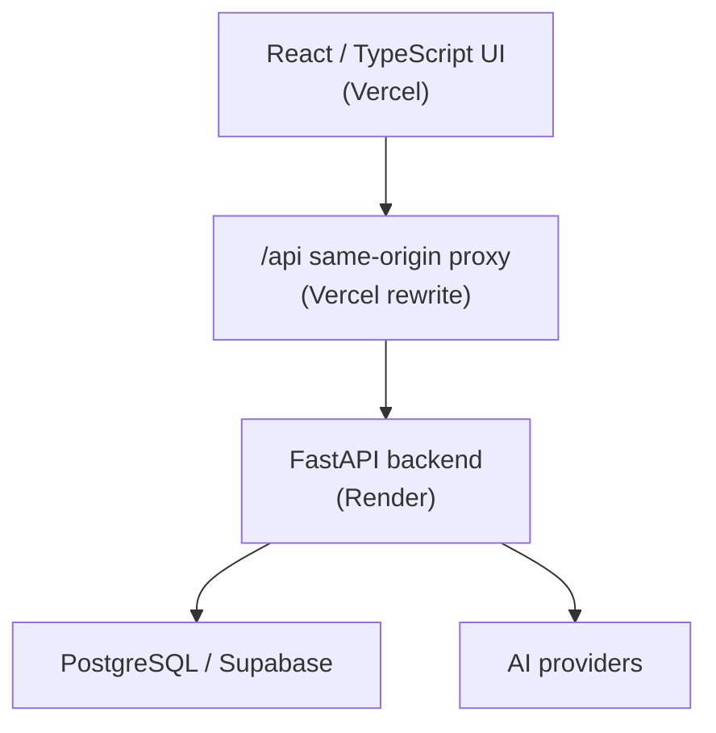
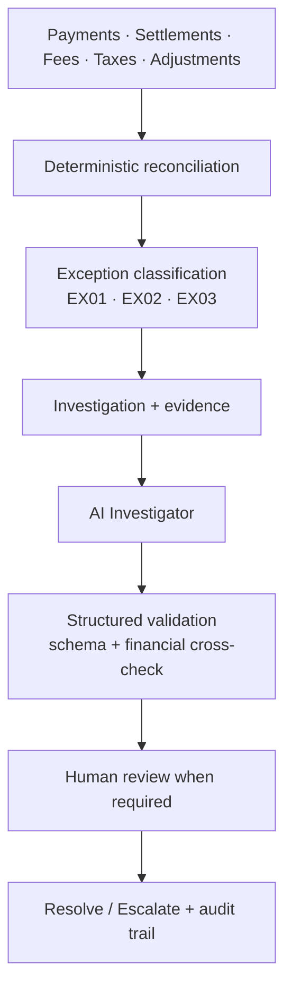
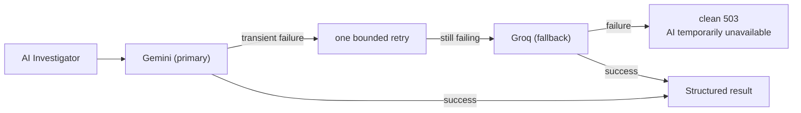

# LedgerLens

**An AI Finance Controller that reconciles payments, detects financial exceptions, investigates their root cause from evidence, and puts a human reviewer in charge of the decision.**

Built for the **Razorpay AI Buildathon 2026 — Track 04: AI Finance Controller**.

---

## Live Demo

**▶ [https://ledgerlens-six.vercel.app](https://ledgerlens-six.vercel.app)**

Sign in with one of the two seeded demo accounts:

| Account | Email | Can resolve / escalate |
|---|---|---|
| Analyst | `analyst@ledgerlens.dev` | No |
| Reviewer | `reviewer@ledgerlens.dev` | Yes |

Passwords are supplied to the deployment through environment variables and are **not** stored in this repository — ask the maintainer for demo credentials. You can also register a new account from the login screen; new registrations receive the Analyst role.

The API is deployed separately at `https://ledgerlens-api-01sp.onrender.com` and is reached from the frontend through a same-origin `/api` proxy.

> The backend runs on a free Render instance, so the first request after a period of inactivity may take a few seconds to wake the service.

---

## The problem

Financial reconciliation is not only about detecting that two numbers differ. A useful finance-control system has to answer:

- What went wrong?
- Which records provide the evidence?
- What is the likely root cause?
- What contradicts that hypothesis?
- What does the AI recommend?
- What did the human reviewer actually decide?
- Can the whole decision be audited later?

LedgerLens is built around that complete workflow rather than treating AI as a chatbot bolted onto a ledger.

---

## Trust and control model

This is the part that matters most for a finance-control system, so it comes first.

**Financial calculations are deterministic and are never delegated to the LLM.** Reconciliation, expected-settlement arithmetic, fee/tax/adjustment rollups and exception classification are all computed by ordinary Python and SQL in `backend/app/reconciliation/`. The same input always produces the same output.

The AI layer is **additive**. It runs only after a deterministic investigation already exists, and its job is to explain evidence, not to compute money.

| Control | How it is enforced |
|---|---|
| Deterministic arithmetic | Reconciliation engine computes every figure; the LLM receives them as "KNOWN, VERIFIED FACTS" |
| Structured output only | The model must call a submit tool matching the `AiInvestigationResult` schema; free-text answers are rejected |
| Schema validation | Pydantic validates the model's output before anything is persisted |
| Financial cross-check | Every amount the AI reports back is compared against the persisted `financial_analysis`; a mismatch is **rejected outright, never silently corrected** |
| Read-only tools | The AI can only call an allow-listed set of read-only lookups; unknown tool names are recorded and refused |
| Bounded execution | Hard caps on model turns and total tool calls per investigation |
| No partial writes | If validation fails, nothing is persisted — no half-written investigation |
| AI cannot decide | The AI may recommend `NO_ACTION`, `HUMAN_REVIEW` or `ESCALATE`; only a Reviewer can resolve or escalate |
| Role enforcement | Analyst/Reviewer permissions are enforced by the backend API, not by frontend visibility |
| Controlled failure | If the AI is unavailable, the API returns a clean error — it never fabricates a financial result |

Every tool call the AI makes is recorded in the audit trail whether it succeeds or fails.

---

## Product walkthrough

The application follows the financial-control workflow end to end.

**1. Overview** — the control summary. Gross processed, expected vs. observed settlement, the current settlement gap, and the open exception load by category. This is the "is anything wrong today?" screen.

**2. Reconciliation** — runs the deterministic engine over the payment, settlement, fee, tax and adjustment records. For each payment it computes the expected net settlement, compares it against what was actually observed, and writes a reconciliation link. Re-running is idempotent: repeated runs do not create duplicate exceptions.

**3. Exceptions** — everything the engine could not reconcile, classified into three types:

| Code | Meaning | The question it raises |
|---|---|---|
| `EX01` | Amount mismatch | Why is the settlement different from the expected amount? |
| `EX02` | Missing settlement | Did settlement genuinely never happen, or is it still pending? |
| `EX03` | Duplicate settlement | How many settlements really reference this payment, and which are bank-confirmed? |

**4. Investigation** — opening an exception starts a deterministic investigation that gathers the related records and computes the financial analysis. This happens before any AI is involved.

**5. Evidence and financial impact** — the investigation detail view separates *Summary*, *Evidence*, *Hypotheses* and *Financials*. Evidence rows point at the actual records examined; the financials tab shows the gross → fees → tax → adjustments → expected → observed walk, so the gap is traceable to line items rather than asserted.

**6. AI Investigation** — on an investigation flagged for human review, the AI Investigator gathers further evidence through read-only tools and returns a structured finding: what is **known**, what is **likely**, what is **not proven**, plus hypotheses with supporting and contradicting evidence, a confidence score and a recommendation. It is explicitly required to distinguish proven fact from inference.

**7. Reviewer decision** — a Reviewer reads the evidence and the AI's recommendation and then resolves or escalates. The human decision is stored separately from the AI recommendation, so the record shows both what was advised and what was decided.

**8. Reports** — a finance-controller view over a chosen date range: financial control summary, exception analysis by status, financial impact, investigation outcomes and AI insights, with CSV export.

---

## Screenshots

> Screenshots have not yet been added to this repository.
>
> Place image files under `docs/screenshots/` and link them from this section. Until then, the [live demo](https://ledgerlens-six.vercel.app) is the best way to see the interface.

---

## Architecture

### Deployment



The `/api` rewrite makes the API same-origin with the frontend, so the session cookie stays first-party.

### Financial control flow



All financial arithmetic happens in the deterministic reconciliation step. The AI Investigator explains the evidence behind an exception; it does not compute the figures.

### AI provider path



---

## AI investigation architecture

The model layer sits behind one provider-agnostic interface (`backend/app/ai/providers/`), so the tool set, the output schema, the financial validation and the persistence logic are identical no matter which provider runs.

| | |
|---|---|
| **Primary** | **Gemini** — selected by `AI_PROVIDER`, the default |
| **Also supported** | **Anthropic** — set `AI_PROVIDER=anthropic` |
| **Fallback** | **Groq** — attached automatically when `GROQ_API_KEY` is set |

**Failover policy**

1. Gemini runs first.
2. On a **transient** failure (503 overloaded, 429 rate limit, timeout, connection error) it gets **exactly one** retry with short jittered backoff.
3. If the retry also fails transiently, the request falls back to **Groq**.
4. If Groq returns a 429 with a `Retry-After`, that hint is honoured **only** when the provider asks for a short wait that still fits the remaining time budget. A long advertised delay is refused and the request fails fast rather than risking a gateway timeout. The wait is always provider-directed and bounded — never open-ended.
5. If every provider fails, the API returns a **clean 503** — `"AI Investigator is temporarily unavailable. Please try again in a moment."` Raw provider errors stay in the server logs and are never shown to the user.

**Permanent failures are not hidden.** A bad API key, an unknown model or a malformed request is surfaced as itself rather than being disguised as "temporarily unavailable" by a pointless retry and fallback.

**Both providers use the same structured investigation result schema** (`AiInvestigationResult`), the same system prompt, the same evidence message and the same read-only tool definitions. A fallback that asked a different question could produce a different answer, so it does not.

**Output is validated before persistence** — schema validation plus the financial cross-check described above. Malformed or inconsistent output is rejected and nothing is written.

`GROQ_API_KEY` is read only by the backend and is never sent to, or referenced by, the frontend. The same is true of the Gemini, Anthropic and Razorpay credentials.

> **Known limitation.** The Groq fallback is not a guarantee. On free-tier / on-demand Groq accounts the tokens-per-minute limit can be exhausted by a long multi-turn investigation, in which case the fallback ends in the clean 503 above rather than a completed analysis. This is an external provider-capacity limit; the failure is graceful and never produces a fabricated result.

---

## Engineering highlights

### Reconciliation performance: 531 → 7 database round trips

The reconciliation endpoint was timing out in production with a 502. Instrumenting the psycopg cursor rather than guessing showed the cause was query volume, not AI calls or serialization:

| | Before | After |
|---|---|---|
| Database round trips (100 payments) | **531** | **7** |
| Backend-reported internal duration | ~21+ seconds | **2.105 seconds** |
| Production result | 502 timeout | HTTP 200 |

Per-payment queries were replaced with bulk lookups and grouped rollups: settlements are fetched for all payments in one query, fee/tax/adjustment totals become three grouped aggregates, and exception/link inserts are buffered into multi-row statements. The classification logic was not touched — the golden 100-row output was verified **byte-identical** before and after, and query-count regression tests now pin the improvement.

*Precision note:* 2.105 s is the **backend-reported internal duration**. The full production HTTP request measured approximately **8.6 seconds** end to end through the Vercel → Render path, which includes network latency and Render cold-start effects. The 2.105 s figure is not the total request time.

### Production authentication

The deployed frontend and API are different sites, so the session cookie needed `SameSite=None; Secure` in production while staying `Lax` over plain HTTP locally. Both attributes derive from one environment flag so they can never disagree. A Vercel `/api` rewrite additionally makes the API same-origin, keeping the cookie first-party against browser third-party-cookie blocking.

### AI provider failover

Described above — a provider seam with transient/permanent error classification, one bounded retry, a bounded provider-directed fallback, and a clean user-facing error instead of leaked provider internals.

---

## Roles

| Capability | Analyst | Reviewer |
|---|:---:|:---:|
| View financial data | ✓ | ✓ |
| View exceptions | ✓ | ✓ |
| View investigations | ✓ | ✓ |
| Run investigations | ✓ | ✓ |
| Run AI investigations | ✓ | ✓ |
| Resolve investigations | — | ✓ |
| Escalate investigations | — | ✓ |

New users registering through the application receive the Analyst role. Reviewer-only actions are enforced by the backend API and do not depend on frontend visibility.

---

## Data sources

### Deterministic evaluation dataset

A reproducible benchmark of **100 payments** and **30 exceptions**:

| Code | Count |
|---|---|
| `EX01` Amount mismatch | 15 |
| `EX02` Missing settlement | 8 |
| `EX03` Duplicate settlement | 7 |

Reconciliation is idempotent — repeated runs do not create duplicate exceptions, and the dataset produces the same classification every time.

### Razorpay Test Mode

LedgerLens can ingest and normalize live payment data from the Razorpay Test Mode API: it connects, retrieves payments, normalizes the external records, persists them, runs reconciliation and surfaces any resulting exceptions for investigation.

Razorpay credentials are server-side only and are never exposed to the frontend.

---

## Tech stack

**Frontend** — React, TypeScript, Vite, Tailwind CSS, React Router, TanStack Query
**Backend** — Python, FastAPI, Pydantic, psycopg
**Database** — PostgreSQL (Supabase)
**AI** — Google Gemini (primary), Groq (fallback), Anthropic (supported), structured tool calling
**Integrations** — Razorpay Test Mode API

---

## Local development

### Backend

```bash
cd backend

python3 -m venv .venv
source .venv/bin/activate

pip install -r requirements.txt

uvicorn app.main:app --reload --port 8000
```

Runs on `http://localhost:8000`.

### Frontend

In another terminal:

```bash
cd frontend

npm install
npm run dev
```

Runs on `http://localhost:5173`.

---

## Environment variables

Copy the example files and fill in real values:

```bash
cp .env.example .env             # project root
cp backend/.env.example backend/.env   # backend-specific reference
cp frontend/.env.example frontend/.env
```

The example files contain **variable names and placeholders only** — no real values.

| Variable | Purpose |
|---|---|
| `SUPABASE_URL`, `SUPABASE_PUBLISHABLE_KEY`, `SUPABASE_DB_URL` | Database connection |
| `RAZORPAY_KEY_ID`, `RAZORPAY_KEY_SECRET` | Razorpay Test Mode ingestion (server-side only) |
| `AI_PROVIDER` | Selects the primary AI provider: `gemini` (default) or `anthropic` |
| `GEMINI_API_KEY` | Primary AI provider credential |
| `ANTHROPIC_API_KEY` | Required only when `AI_PROVIDER=anthropic` |
| `GROQ_API_KEY` | Fallback provider credential — optional, backend-only |
| `DEMO_ANALYST_PASSWORD`, `DEMO_REVIEWER_PASSWORD` | Required by the demo-user seeder |
| `CORS_ALLOWED_ORIGINS` | Origins permitted to call the API |
| `ENV` | Set to `production` to make the session cookie `Secure` |

**Rules**

- Secrets are supplied **only** through environment variables.
- Secrets are **never** committed. `.env` files are gitignored; only `.env.example` files are tracked.
- `frontend/.env` holds no secrets — only the API base URL.

### Seeding the demo accounts

Both demo passwords must be supplied through the environment. The seeder has **no built-in defaults**, so no working credential is ever stored in this repository, and it fails with a clear configuration error if either variable is missing:

```bash
DEMO_ANALYST_PASSWORD='...' DEMO_REVIEWER_PASSWORD='...' \
  backend/.venv/bin/python backend/scripts/seed_demo_users.py
```

Seeding is idempotent — re-running rotates the passwords in place rather than creating duplicate accounts.

---

## Testing

```bash
# Backend
cd backend && source .venv/bin/activate
pytest -q

# Frontend
cd frontend
npm test -- --run
npx tsc -b
npx oxlint .
npm run build
```

Current verification:

| Check | Result |
|---|---|
| Backend tests | **203 passed** |
| Frontend tests | **19 passed** |
| TypeScript | clean |
| Oxlint | 0 warnings, 0 errors |
| Production build | successful |

The suite covers reconciliation determinism and query-count regressions, the exception taxonomy, investigation and resolution workflows, role enforcement, authentication and session-cookie policy, the Razorpay data source, reporting, and the AI provider failover chain (with mocked providers — no live API calls in tests).

---

## Responsive interface

Verified with no horizontal page overflow at 1440px, 1024px, 820px and 390px viewport widths.

---

## Security

- PBKDF2-HMAC-SHA256 password hashing with per-user salts
- Session-based authentication using httpOnly cookies; `Secure` in production
- Role-based authorization, with reviewer-only mutation endpoints enforced server-side
- Razorpay and AI provider credentials are server-side only and never reach the frontend
- All secrets are environment-managed; `.env` files are excluded from Git
- `.env.example` files contain placeholders only
- Demo passwords are required by the seeder and are not stored in the repository
- No production secrets are included in this repository
- Backend authorization does not depend on frontend visibility
- AI financial values are validated against persisted data before acceptance
- Malformed AI output and unknown tool calls are rejected
- AI failure is handled without partial persistence

---

## Investigation lifecycle

```text
OPEN
  ↓
IN_PROGRESS
  ↓
HUMAN_REVIEW
  ↓
┌─────────────┐
│             │
▼             ▼
RESOLVED    ESCALATED
```

The AI recommendation and the human decision are stored separately — for example an AI recommendation of `HUMAN_REVIEW` alongside a human decision of `RESOLVED`. This preserves an auditable record of what the AI advised and what the authorized reviewer actually decided.

---

## Project structure

```text
.
├── backend/
│   ├── app/
│   │   ├── ai/
│   │   │   ├── providers/      # gemini · groq · anthropic · failover
│   │   │   ├── config.py
│   │   │   ├── investigator.py
│   │   │   ├── schemas.py
│   │   │   └── tools.py
│   │   ├── auth/
│   │   ├── datasources/
│   │   ├── exceptions/
│   │   ├── investigation/
│   │   ├── reconciliation/
│   │   └── reports/
│   ├── scripts/
│   ├── tests/
│   └── requirements.txt
│
├── database/
│   └── migrations/
│
├── frontend/
│   ├── src/
│   │   ├── api/
│   │   ├── components/
│   │   ├── domain/
│   │   ├── lib/
│   │   └── pages/
│   └── package.json
│
└── README.md
```

---

## License

**To be determined.** No license has been selected for this repository yet.

---

## Buildathon

**Razorpay AI Buildathon 2026 — Track 04: AI Finance Controller**

LedgerLens combines deterministic financial controls, evidence-driven AI investigation and explicit human decision-making into a single auditable workflow.

### Project status

Buildathon-ready release candidate. The core workflow is implemented and verified end to end: authentication and signup, role-based access, reconciliation, exception detection, duplicate settlement detection, investigation workflows, evidence and hypotheses, contradiction tracking, AI investigation with provider failover, human review, resolution and escalation, Razorpay Test Mode integration, reporting with CSV export, a responsive frontend, and automated backend and frontend tests.
