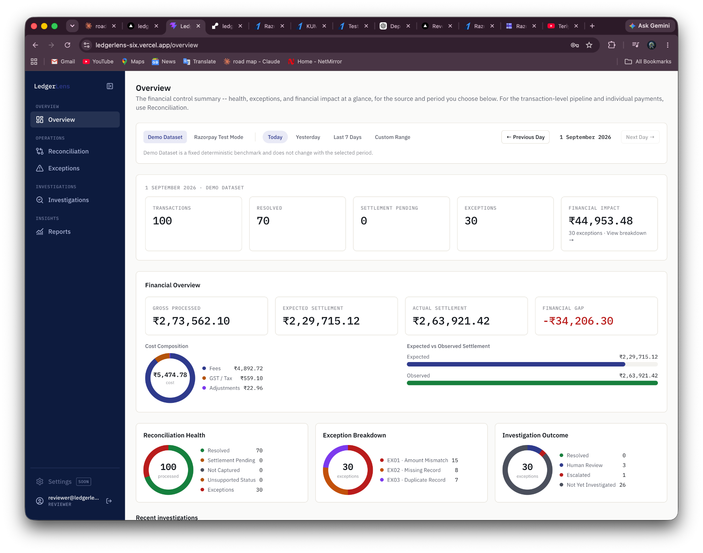
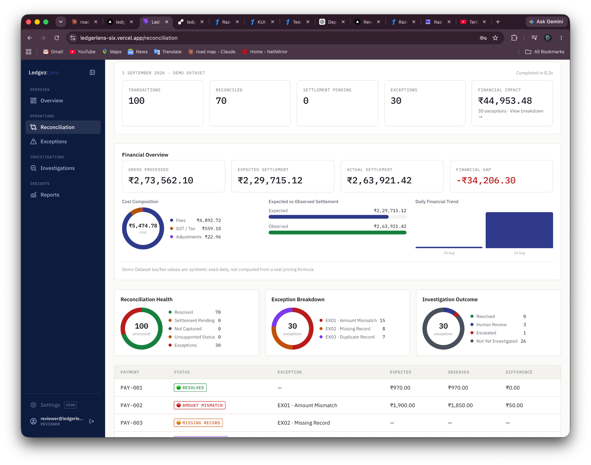
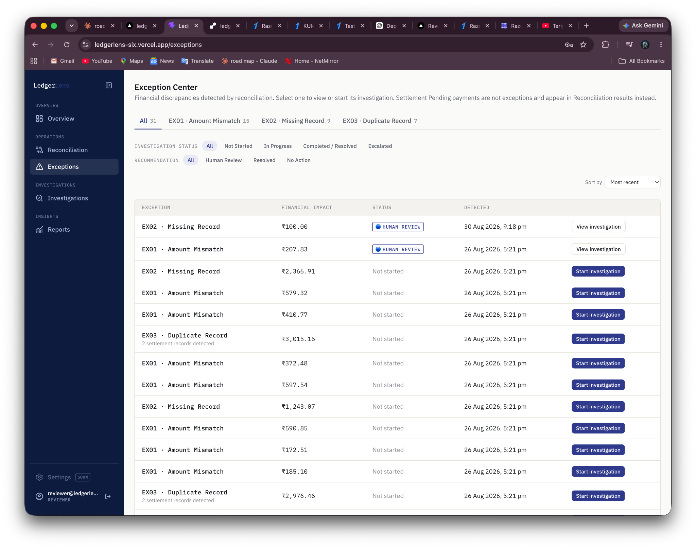
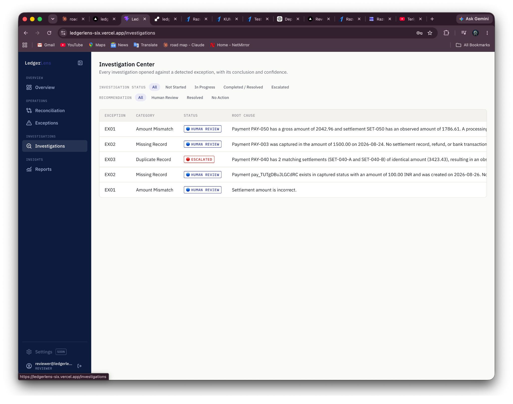
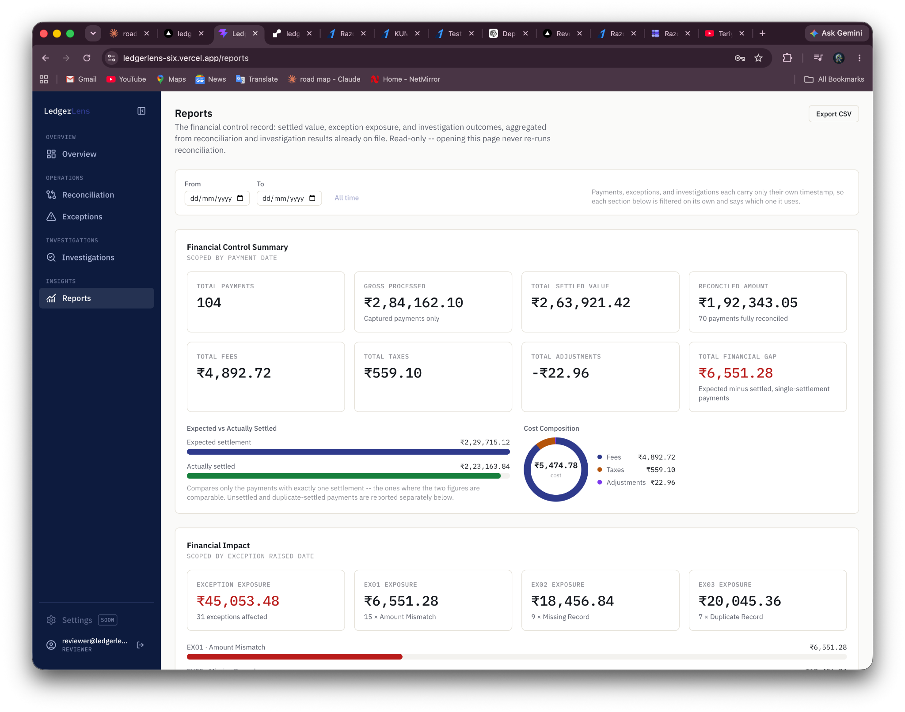
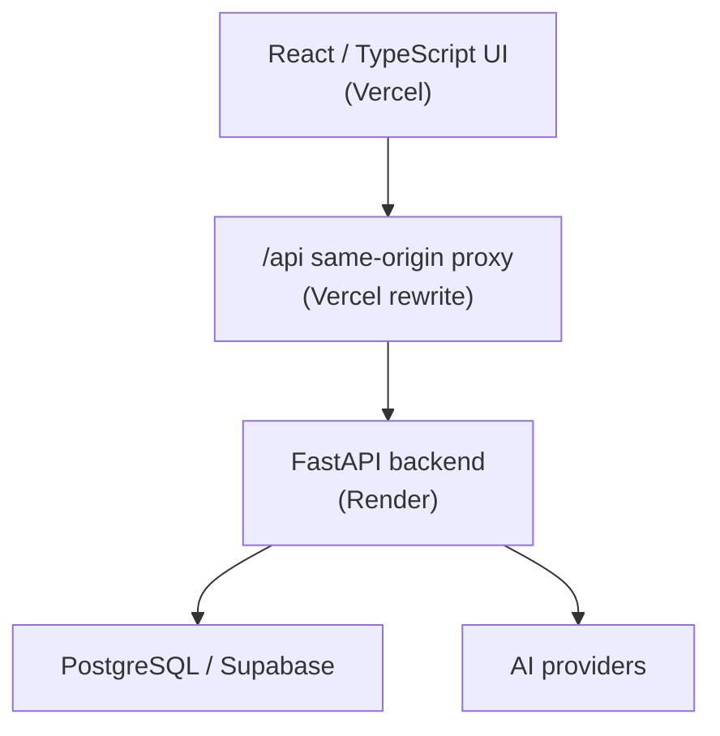
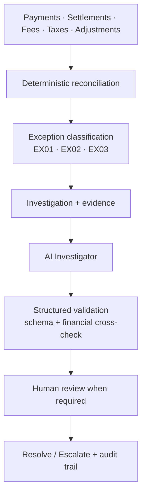
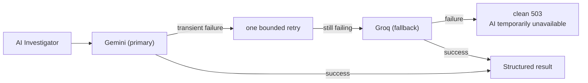

# LedgerLens

[](https://github.com/kd040/ledgerlens/actions/workflows/backend-ci.yml)
[](https://github.com/kd040/ledgerlens/actions/workflows/frontend-ci.yml)

**An AI Finance Controller that reconciles payments against settlements, detects financial exceptions, investigates their root cause from evidence, and puts a human reviewer in charge of the decision.**

Financial calculations stay deterministic. The AI explains evidence — it never computes money.

Built for the **Razorpay AI Buildathon 2026 — Track 04: AI Finance Controller**.

---

## Live Demo

**▶ [https://ledgerlens-six.vercel.app](https://ledgerlens-six.vercel.app)**

Sign in with one of the two seeded demo accounts:

| Account | Email | Can resolve / escalate |
|---|---|---|
| Analyst | `analyst@ledgerlens.dev` | No |
| Reviewer | `reviewer@ledgerlens.dev` | Yes |

Demo passwords are supplied to the deployment through environment configuration and are provided separately — they are **not** stored in this repository. You can also register a new account from the login screen; new registrations receive the Analyst role.

The API is deployed separately at `https://ledgerlens-api-01sp.onrender.com` and is reached from the frontend through a same-origin `/api` proxy.

> The backend runs on a free Render instance, so the first request after a period of inactivity may take a few seconds to wake the service.

---

## What LedgerLens Does

A payment gateway tells you money moved. It does not tell you whether the money that *arrived* matches the money you were *owed* — after fees, taxes and adjustments — or what to do when it doesn't.

Reconciliation is not only about detecting that two numbers differ. A useful finance-control system has to answer:

- What went wrong?
- Which records provide the evidence?
- What is the likely root cause?
- What contradicts that hypothesis?
- What does the AI recommend?
- What did the human reviewer actually decide?
- Can the whole decision be audited later?

LedgerLens answers all seven. It recomputes the expected settlement for every payment from its own line items, classifies whatever fails to reconcile into three exception types, builds an evidence-backed investigation for each one, and asks an AI investigator to explain the evidence — then hands the decision to a human reviewer and records both the recommendation and the decision separately.

**Why deterministic reconciliation matters.** In a financial control system, the arithmetic must be reproducible and auditable. The same inputs must always produce the same figures, and a regulator or auditor must be able to re-derive any number from source records. A language model cannot offer that guarantee, so LedgerLens does not ask it to: every figure is computed in Python and SQL, and the AI receives those figures as fixed facts it is forbidden to recompute.

---

## Core Workflow

```text
Source records  (payments · settlements · fees · taxes · adjustments)
        ↓
Deterministic reconciliation        ← all financial arithmetic happens here
        ↓
Exception classification            EX01 · EX02 · EX03
        ↓
Investigation                       deterministic, evidence gathered from real records
        ↓
Evidence + financial validation
        ↓
AI-assisted findings                structured output, validated before persistence
        ↓
Human review                        Reviewer resolves or escalates
        ↓
Reporting + audit trail
```

**Deterministic financial calculations are not delegated to the LLM.** Reconciliation, expected-settlement arithmetic, fee/tax/adjustment rollups and exception classification are all computed by ordinary Python and SQL in `backend/app/reconciliation/`. The AI layer is additive: it runs only after a deterministic investigation already exists, and its role is to explain the evidence behind an exception, not to produce the numbers.

---

## Product Walkthrough

### Financial Control Dashboard

The control summary — the "is anything wrong today?" screen. It shows gross processed value, expected versus observed settlement, the current settlement gap, and the open exception load broken down by category, so a controller can see exposure before opening a single record.



### Deterministic Reconciliation

Runs the reconciliation engine over the payment, settlement, fee, tax and adjustment records. For each payment it computes the expected net settlement, compares it against what was actually observed, and writes a reconciliation link. Anything that fails to reconcile becomes a classified exception.

Re-running is idempotent — repeated runs do not create duplicate exceptions, and the same dataset always produces the same classification.



### Exception Management

Everything the engine could not reconcile, classified into three types:

| Code | Meaning | The question it raises |
|---|---|---|
| `EX01` | Amount Mismatch | Why is the settlement different from the expected amount? |
| `EX02` | Missing Record | Did settlement genuinely never happen, or is it still pending? |
| `EX03` | Duplicate Record | How many settlements really reference this payment, and which are bank-confirmed? |

Each exception carries its financial impact and current status, and can be opened into a full investigation.



### AI-Assisted Investigation

Opening an exception starts a **deterministic** investigation that gathers the related records and computes the financial analysis — before any AI is involved. The detail view separates *Summary*, *Evidence*, *Hypotheses* and *Financials*; the financials tab shows the gross → fees → tax → adjustments → expected → observed walk, so the gap is traceable to line items rather than asserted.

The AI Investigator then gathers further evidence through read-only tools and returns a structured finding: what is **known**, what is **likely**, and what is **not proven**, plus hypotheses with supporting and contradicting evidence, a confidence score and a recommendation. It is explicitly required to distinguish proven fact from inference.

The AI may recommend `NO_ACTION`, `HUMAN_REVIEW` or `ESCALATE` — it never resolves or escalates anything itself. A Reviewer reads the evidence and the recommendation and makes the call. The human decision is stored separately from the AI recommendation, so the record shows both what was advised and what was decided.



### Financial Control Reporting

A finance-controller view over a chosen date range: financial control summary, exception analysis by status, financial impact including settlement values, fees and adjustments, investigation outcomes and AI insights — with CSV export for downstream reporting.



---

## Trust and Control Model

The controls that make the AI layer safe to put in front of financial data:

| Control | How it is enforced |
|---|---|
| Deterministic arithmetic | Reconciliation engine computes every figure; the LLM receives them as "KNOWN, VERIFIED FACTS" |
| Structured output only | The model must call a submit tool matching the `AiInvestigationResult` schema; free-text answers are rejected |
| Schema validation | Pydantic validates the model's output before anything is persisted |
| Financial cross-check | Every amount the AI reports back is compared against the persisted `financial_analysis`; a mismatch is **rejected outright, never silently corrected** |
| Read-only tools | The AI can only call an allow-listed set of read-only lookups; unknown tool names are recorded and refused |
| Bounded execution | Hard caps on model turns and total tool calls per investigation |
| No partial writes | If validation fails, nothing is persisted — no half-written investigation |
| AI cannot decide | The AI may recommend `NO_ACTION`, `HUMAN_REVIEW` or `ESCALATE`; only a Reviewer can resolve or escalate |
| Role enforcement | Analyst/Reviewer permissions are enforced by the backend API, not by frontend visibility |
| Controlled failure | If the AI is unavailable, the API returns a clean error — it never fabricates a financial result |

Every tool call the AI makes is recorded in the audit trail whether it succeeds or fails.

---

## Architecture

### Deployment



The `/api` rewrite makes the API same-origin with the frontend, so the session cookie stays first-party.

### Financial control flow



All financial arithmetic happens in the deterministic reconciliation step. The AI Investigator explains the evidence behind an exception; it does not compute the figures.

### AI provider failover



---

## AI Investigation Architecture

The model layer sits behind one provider-agnostic interface (`backend/app/ai/providers/`), so the tool set, the output schema, the financial validation and the persistence logic are identical no matter which provider runs.

| | |
|---|---|
| **Primary** | **Gemini** — selected by `AI_PROVIDER`, the default |
| **Also supported** | **Anthropic** — set `AI_PROVIDER=anthropic` |
| **Fallback** | **Groq** — attached automatically when `GROQ_API_KEY` is set |

**Failover policy**

1. Gemini runs first.
2. On a **transient** failure (503 overloaded, 429 rate limit, timeout, connection error) it gets **exactly one** retry with short jittered backoff.
3. If the retry also fails transiently, the request falls back to **Groq**.
4. If Groq returns a 429 with a `Retry-After`, that hint is honoured **only** when the provider asks for a short wait that still fits the remaining retry budget. A long advertised delay is refused and the request fails fast rather than risking a gateway timeout. The wait is always provider-directed and bounded — never open-ended.
5. If every provider fails, the API returns a **clean 503** — `"AI Investigator is temporarily unavailable. Please try again in a moment."` Raw provider errors stay in the server logs and are never shown to the user.

**Permanent failures are not hidden.** A bad API key, an unknown model or a malformed request is surfaced as itself rather than being disguised as "temporarily unavailable" by a pointless retry and fallback.

**Both providers use the same investigation prompt, tool set and result schema** (`AiInvestigationResult`) — the same system prompt, the same evidence message and the same read-only tool definitions. A fallback that asked a different question could produce a different answer, so it does not.

**Output is validated before persistence** — schema validation plus the financial cross-check described above. Malformed or inconsistent output is rejected and nothing is written.

**No LLM-generated financial calculations.** Every figure the AI reports must match the persisted deterministic analysis exactly, or the response is rejected.

`GROQ_API_KEY` is read only by the backend and is never sent to, or referenced by, the frontend. The same is true of the Gemini, Anthropic and Razorpay credentials.

See [Known Limitations](#known-limitations) for the provider-capacity constraint on the Groq fallback.

---

## Engineering Highlights

- **Reconciliation batched from 531 → 7 database round trips** for the 100-payment benchmark, taking backend-reported internal duration from ~21+ seconds to **2.105 seconds** and turning a production 502 timeout into an HTTP 200. Details below.
- **Deterministic 100-record benchmark** — 100 payments, 30 exceptions (15 / 8 / 7), reproducible and idempotent across runs.
- **AI provider failover** — provider seam with transient/permanent error classification, one bounded Gemini retry, bounded provider-directed Groq fallback, and a clean user-facing error instead of leaked provider internals.
- **Structured validation before persistence** — schema validation plus a financial cross-check; nothing is written unless both pass.
- **203 backend tests** and **19 frontend tests** passing; TypeScript clean, oxlint clean, production build successful.

### Reconciliation performance: 531 → 7 database round trips

The reconciliation endpoint was timing out in production with a 502. Instrumenting the psycopg cursor rather than guessing showed the cause was query volume, not AI calls or serialization:

| | Before | After |
|---|---|---|
| Database round trips (100 payments) | **531** | **7** |
| Backend-reported internal duration | ~21+ seconds | **2.105 seconds** |
| Production result | 502 timeout | HTTP 200 |

Per-payment queries were replaced with bulk lookups and grouped rollups: settlements are fetched for all payments in one query, fee/tax/adjustment totals become three grouped aggregates, and exception/link inserts are buffered into multi-row statements. The classification logic was not touched — the golden 100-row output was verified **byte-identical** before and after, and query-count regression tests now pin the improvement.

*Precision note:* 2.105 s is the **backend-reported internal duration**. The full production HTTP request measured approximately **8.6 seconds** end to end through the Vercel → Render path, which includes network latency and Render cold-start effects. The 2.105 s figure is not the total request time.

### Production authentication

The deployed frontend and API are different sites, so the session cookie needed `SameSite=None; Secure` in production while staying `Lax` over plain HTTP locally. Both attributes derive from one environment flag so they can never disagree. A Vercel `/api` rewrite additionally makes the API same-origin, keeping the cookie first-party against browser third-party-cookie blocking.

---

## Security & Data Integrity

**Secrets**

- All secrets are supplied through environment variables; none are committed.
- `.env` files are gitignored. Only `.env.example` files are tracked, and they contain **variable names and placeholders only**.
- Demo passwords are required by the seeder and are **not stored in this repository** — the seeder has no built-in defaults and fails with a clear configuration error if they are missing.
- `GROQ_API_KEY` is backend-only, as are the Gemini, Anthropic and Razorpay credentials. None are exposed to, or referenced by, the frontend.
- No production secrets are included in this repository.

**Authentication and authorization**

- PBKDF2-HMAC-SHA256 password hashing with per-user salts.
- Session-based authentication using httpOnly cookies; `Secure` in production.
- Role-based authorization with reviewer-only mutation endpoints enforced server-side, independent of frontend visibility.

**Data integrity**

- The demo dataset is **synthetic and deterministic** — no real customer or payment data.
- The benchmark is protected from test residue: the suite uses throwaway fixtures and cleans up after itself, and integrity checks verify the benchmark is unchanged after every run.
- AI output is validated against the schema and cross-checked against persisted financial data before acceptance.
- Malformed AI output and unknown tool calls are rejected.
- AI failure is handled without partial persistence.

---

## Roles

| Capability | Analyst | Reviewer |
|---|:---:|:---:|
| View financial data | ✓ | ✓ |
| View exceptions | ✓ | ✓ |
| View investigations | ✓ | ✓ |
| Run investigations | ✓ | ✓ |
| Run AI investigations | ✓ | ✓ |
| Resolve investigations | — | ✓ |
| Escalate investigations | — | ✓ |

New users registering through the application receive the Analyst role. Reviewer-only actions are enforced by the backend API and do not depend on frontend visibility.

---

## Data Sources

### Deterministic evaluation dataset

A reproducible, synthetic benchmark of **100 payments** and **30 exceptions**:

| Code | Count |
|---|---|
| `EX01` Amount Mismatch | 15 |
| `EX02` Missing Record | 8 |
| `EX03` Duplicate Record | 7 |

Reconciliation is idempotent — repeated runs do not create duplicate exceptions, and the dataset produces the same classification every time.

### Razorpay Test Mode

LedgerLens can ingest and normalize live payment data from the Razorpay Test Mode API: it connects, retrieves payments, normalizes the external records, persists them, runs reconciliation and surfaces any resulting exceptions for investigation.

Razorpay credentials are server-side only and are never exposed to the frontend.

---

## Tech Stack

**Frontend** — React, TypeScript, Vite, Tailwind CSS, React Router, TanStack Query
**Backend** — Python, FastAPI, Pydantic, psycopg
**Database** — PostgreSQL (Supabase)
**AI** — Google Gemini (primary), Groq (fallback), Anthropic (supported), structured tool calling
**Integrations** — Razorpay Test Mode API

---

## Testing & Verification

```bash
# Backend
cd backend && source .venv/bin/activate
pytest -q

# Frontend
cd frontend
npm test -- --run
npx tsc -b
npx oxlint .
npm run build
```

Current verification:

| Check | Result |
|---|---|
| Backend tests | **203 passed** |
| Frontend tests | **19 passed** |
| TypeScript | clean |
| Oxlint | 0 warnings, 0 errors |
| Production build | successful |
| Data-integrity checks | passed |

The suite covers reconciliation determinism and query-count regressions, the exception taxonomy, investigation and resolution workflows, role enforcement, authentication and session-cookie policy, the Razorpay data source, reporting, and the AI provider failover chain. Provider tests use mocked transports — no live AI API calls are made in the test suite.

Data-integrity checks confirm the benchmark is unchanged after a full run: 100 `PAY-*` payments, EX01 15 / EX02 8 / EX03 7, 100 reconciliation links, 0 unintended human decisions, and no test residue.

---

## Local Development

### Backend

```bash
cd backend

python3 -m venv .venv
source .venv/bin/activate

pip install -r requirements.txt

uvicorn app.main:app --reload --port 8000
```

Runs on `http://localhost:8000`.

### Frontend

In another terminal:

```bash
cd frontend

npm install
npm run dev
```

Runs on `http://localhost:5173`.

### Environment variables

Copy the example files and fill in real values:

```bash
cp .env.example .env                    # project root — the file the backend loads
cp backend/.env.example backend/.env    # backend-specific reference
cp frontend/.env.example frontend/.env
```

All three example files contain **variable names and placeholders only** — no real values.

| Variable | Purpose |
|---|---|
| `SUPABASE_URL`, `SUPABASE_PUBLISHABLE_KEY`, `SUPABASE_DB_URL` | Database connection |
| `RAZORPAY_KEY_ID`, `RAZORPAY_KEY_SECRET` | Razorpay Test Mode ingestion (server-side only) |
| `AI_PROVIDER` | Selects the primary AI provider: `gemini` (default) or `anthropic` |
| `GEMINI_API_KEY` | Primary AI provider credential |
| `ANTHROPIC_API_KEY` | Required only when `AI_PROVIDER=anthropic` |
| `GROQ_API_KEY` | Fallback provider credential — optional, backend-only |
| `DEMO_ANALYST_PASSWORD`, `DEMO_REVIEWER_PASSWORD` | Required by the demo-user seeder |
| `CORS_ALLOWED_ORIGINS` | Origins permitted to call the API |
| `ENV` | Set to `production` to make the session cookie `Secure` |

`frontend/.env` holds no secrets — only the API base URL.

### Seeding the demo accounts

Both demo passwords must be supplied through the environment. The seeder has **no built-in defaults**, so no working credential is ever stored in this repository, and it fails with a clear configuration error if either variable is missing:

```bash
DEMO_ANALYST_PASSWORD='...' DEMO_REVIEWER_PASSWORD='...' \
  backend/.venv/bin/python backend/scripts/seed_demo_users.py
```

Seeding is idempotent — re-running rotates the passwords in place rather than creating duplicate accounts.

---

## Known Limitations

- **Render cold starts.** The backend is deployed on a free Render instance. After a period of inactivity the first request has to wake the service and may take several seconds. Subsequent requests are fast.
- **Groq free/on-demand TPM constraints.** The current Groq tier has an 8,000 tokens-per-minute limit. Because the provider debits TPM as prompt plus reserved completion tokens on every turn, a long multi-turn investigation can exhaust the window.
- **The Groq fallback is resilience engineering, not a guarantee of unlimited AI capacity.** When the TPM window is exhausted, the fallback ends in the clean 503 path described above rather than a completed analysis. The failure is graceful and never produces a fabricated or partial financial result, but it is a real capacity ceiling on the current tier.
- **Exchange and bank holidays are not modelled.** Settlement-timing logic treats business days as weekdays; a holiday calendar is not implemented.

---

## Investigation Lifecycle

```text
OPEN
  ↓
IN_PROGRESS
  ↓
HUMAN_REVIEW
  ↓
┌─────────────┐
│             │
▼             ▼
RESOLVED    ESCALATED
```

The AI recommendation and the human decision are stored separately — for example an AI recommendation of `HUMAN_REVIEW` alongside a human decision of `RESOLVED`. This preserves an auditable record of what the AI advised and what the authorized reviewer actually decided.

---

## Project Structure

```text
.
├── backend/
│   ├── app/
│   │   ├── ai/
│   │   │   ├── providers/      # gemini · groq · anthropic · failover
│   │   │   ├── config.py
│   │   │   ├── investigator.py
│   │   │   ├── schemas.py
│   │   │   └── tools.py
│   │   ├── auth/
│   │   ├── datasources/
│   │   ├── exceptions/
│   │   ├── investigation/
│   │   ├── reconciliation/
│   │   └── reports/
│   ├── scripts/
│   ├── tests/
│   └── requirements.txt
│
├── database/
│   └── migrations/
│
├── docs/
│   └── screenshots/
│
├── frontend/
│   ├── src/
│   │   ├── api/
│   │   ├── components/
│   │   ├── domain/
│   │   ├── lib/
│   │   └── pages/
│   └── package.json
│
└── README.md
```

---

## License

**To be determined.** No LICENSE file has been added to this repository yet, and no open-source license has been selected.

---

## Buildathon

**Razorpay AI Buildathon 2026 — Track 04: AI Finance Controller**

LedgerLens combines deterministic financial controls, evidence-driven AI investigation and explicit human decision-making into a single auditable workflow.

### Project status

Buildathon-ready release candidate. The core workflow is implemented and verified end to end: authentication and signup, role-based access, reconciliation, exception detection, duplicate settlement detection, investigation workflows, evidence and hypotheses, contradiction tracking, AI investigation with provider failover, human review, resolution and escalation, Razorpay Test Mode integration, reporting with CSV export, a responsive frontend, and automated backend and frontend tests.
